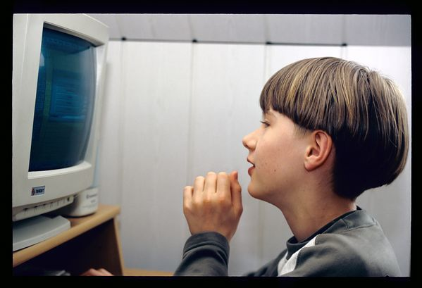
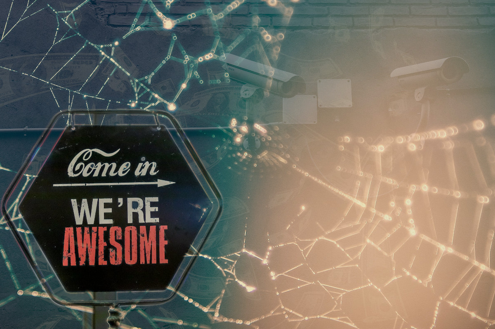
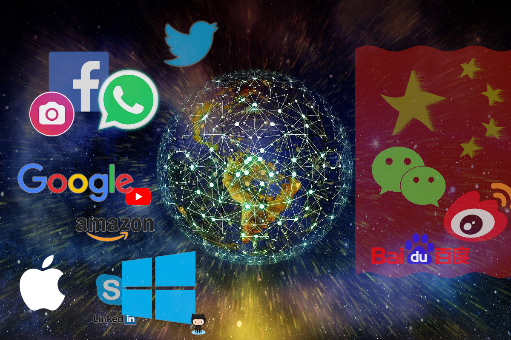
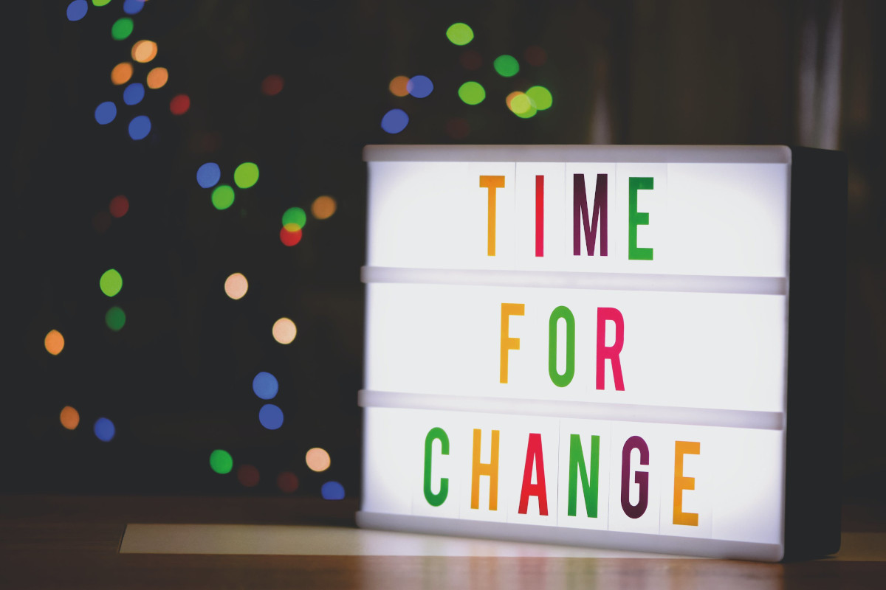

+++
title = "Break Free! Don't be a prisoner of your sofware platform!"
date = 2020-06-06T18:00:28+02:00
draft = false

# Tags and categories
# For example, use `tags = []` for no tags, or the form `tags = ["A Tag", "Another Tag"]` for one or more tags.
tags = ["software", "privacy", "ethics", "social media", "freedom"]
categories = []
+++

# Break Free! Don't be a prisoner of your software platform!

*"An opinion piece on software, social media, and ethics", by Maarten van Gompel (proycon)*

<!-- more -->

I don't use Windows or macOS, I don't use Facebook or Instagram, I won't use
WhatsApp, my Android phone has no Google Play store or Google services. I
minimize my use of Google as a search engine and I don't like using Zoom,
Skype, Facetime or Slack to talk to people. And to add the cherry to the
cake, although you are of course free to choose for yourself, I don't think you
should use any of these either!

*"Well, you sound like a fun person!"*, you might think at this point, and
sometimes people indeed do wonder why I hold the views I do. I won't deny that I
am a bit of an idealist. I don't hold these views to be an annoyance or to cause
inconvenience, but where for most people these are probably rather
inconsequential choices, I do see them as being quite consequential, as I see an
important *ethical* dimension that needs to be addressed.

In this article I will explain my reasoning. I will argue that the increasing
role software plays in our lives, like in the form of social media platforms,
comes with considerable concerns. There is a massive intrusion on our privacy
ongoing, and we are being targetted psychologically in a manner that is not in
our best interest. This is has a direct impact on our societies, our politics,
and ultimately our freedom, which it at the heart of the issue. We must break
free from the walled-in prisons that software platforms lure us into and must
act more responsibly in our new digital role as both consumer and producer.

## And so it begins...

Already when I was in my early teens, I felt the need to break through the
constraints software platforms imposed on me. Our family had a state-of-the-art 486
running DOS and Windows 3.1 at a speedy 33Mhz (assuming the turbo button was
pressed). My dad had wisely put some extra constraints on it in the form of
a DOS-port of a unix shell, which came with some access control measures
preventing me from messing up the whole system.

As I discovered the art of Q-BASIC and the power granted by the SYSTEM command
within, true control over the family computer was quickly within my grasp and I
developed my own "M-DOS" shell; M being my initial; great inventions are often
named after their creator after all, and this is especially appealing if
you're a 12 year-old boy.

Being constrained by your own technology, not being able to use it to its full
potential, always felt wrong to me. At the end of the nineties, I got my actual
'own' Pentium computer that did not need be shared anymore by the family. I had grown
disenchanted with the Windows 95 platform we were running at the time, and
became increasingly intrigued by the fact that there were other operating
systems, more diversity, out there. Seeing my father run UNIX (SunOS) on his
SPARCstation for work was a likely a contributing factor to that.

So eventually I took the plunge and bought a copy of Red Hat Linux on 4 CD-ROMs.
In order to obtain those, I peddled several kilometers on my bike from my
hometown to a major bookstore in the nearest big city, something I had never done
before yet. To this day, this probably still counts as one of my great
achievements in the realm of physical exercise.

In the years leading up this, another new major development had started to
slowly begin taking the world: the advent of the Internet and the World Wide Web
in particular. The web brought a wealth of information and programs that
suddenly became available, my young brain was happy with the new torrent of
input, there was so much to learn and discover! The happiness was subdued only
by the resulting phone bill at the end of the month. Cable internet was new and
hadn't reached our town yet, unfortunately.

The beauty of it all was not just the information you could consume, but
also the fact that you yourself could contribute and share things directly with
anybody in the world. I eagerly subscribed to something called GeoCities and
created my first homepage on the web, initially show-casing some Visual Basic
and Delphi software and some 3D art.

Then there was also Internet Relay Chat (IRC), a way to chat with people all
around the world. There were lots of IRC servers you could connect to, many of
them were grouped into networks. I made connections with many people on there,
founded a language-learning community with a lively IRC chat which I hosted on
my own server for years. I even met my boyfriend on an IRC channel, there were
no such things as Grindr or Tindr yet. To this day, I still actively use IRC,
especially for my daily work to keep in touch with colleagues.

## Who is in control?

In all the years, I have formed some pretty strong opinions about technology,
more specifically, about software, as that is what I am passionate about. I am also
not too inhibited to express these opinions, sometimes to the annoyance of the
recipient.  I choose the tools I use with care, rather than blindly accepting
what the majority of the people force upon you. I go for tools that are
open-source, tools that put the user in control rather than vice versa, and
that promote freedom of choice. I see this as a part of responsible consumerism
which I think should be practised more widely in general.

Even before I switched to Linux in the late nineties, my animosity towards
Microsoft had grown. Here we had this large US company, whose CEO, Bill Gates,
was the richest man in the world, having accumulated a fortune that I still
believe no single individual should ever be able to own. All this because his
company had developed an operating system (Windows), a software platform, that
almost everybody was using. This OS wasn't even particularly good or innovative
from a technical point of view, but it was very cleverly and successfully
marketed at precisely the right time in history. The large majority of software
was written for it, it was hard to get around. It had accumulated a critical
mass that propelled it forward, growing like a snowball going down a snowy
hill. Winter was coming. Microsoft pursued aggressive litigation to
maintain its dominant position and tried their best to hinder the open source
movement in any way they could (in the end they failed and even they have to embrace open source now). A private
monopolist had risen, and this is never a healthy thing in my view.

Software does not just exist in a vacuum, there are societal, economic and,
yes, even moral implications to be be considered. This is about technology and
freedom, about responsible consumerism as I already mentioned earlier. Do the
tools you use give you the freedom to be creative, to be productive, to connect,
or do they ultimately restrain you? Are you controlling your tools or are the
tools ultimately controlling you? Appearances can be deceptive here.

If you are not in control of your software or your device, then someone else
is, and they may not have the same interests you have. Ultimately, a private
software development company seeks financial profit, which is a perfectly
legitimate goal by itself that I am not objecting to, but one has to be aware of
financial incentives that this creates for the vendor that are not in the best
interest of the user.

The internet and world wide web are actually astounding developments, and in a
way I think we can be very lucky that these have taken place as they did, and
that we did not end up with a proprietary internet controlled by a single
company (or by the US military who started it all), which by definition would never have been a
proper internet at all. The internet is all about inter-connectedness and
interoperability. Computers all over the world form a network together because
they speak to each-other, in a language all parties agree upon and can
understand. This language takes the form of communication protocols, such as IP,
TCP, DNS, FTP, IRC, HTTP, SMTP, IMAP and countless more.  These are open and
well documented and everybody with enough skill can write software that
implements these protocols. The whole collective of protocols can be visualised
in layers like that of an onion, where higher-level and more
application-specific protocols make use of lower-level protocols.

Everybody can start their own webserver (server software that implements HTTP),
their own mailserver (server software that implements SMTP), and near-instantly
connect with whomever in the world also speaks this protocol. This decentralised
foundation, also known as federation, is the true power of the internet.

## Caught in the sticky web of hyper-commercialisation

Yet, since the mid-2000's, we've seen the internet change as it grew and grew
in popularity. Social media began its advent, in and of itself a great thing.
Allowing people from all over the world to connect and communicate better is a
worthy goal if you ask me. I am also by nature enthusiastic and
optimistic about true technological innovation. I was among the first
generation to sign-up for Facebook to see what it was like, back in the day
where you could only join with a e-mail address pertaining to a university.

But whereas the growth in the early days of the internet had taken shape in the
form of open protocols, adding new layers to the collective onion, now
the internet has become more and more commercialised and appropriated by big
tech companies. They built their own platforms without offering proper
interoperability. No longer were these platforms built to communicate with
like-minded platforms, allowing everybody to implement their own software for
it. Instead, they often did the reverse, appropriating existing technologies to
build a centralised system. Any users of the platform were effectively trapped
in it, as they can only connect to people using the very same proprietary
platform. As an analogy; how would you like it to be able to send e-mail only to
people who use the same very mail provider as you do? Even being forced to use
one particular e-mail app rather than one you choose?

Why would users pay to be trapped in a network? Well, aside from the fact that
I think most people simply don't understand the implications a lack
of interoperability brings; they didn't have to pay at all! It was all "free"! The
only concession there was to make is that you saw some advertisements here and
there. A new online business model had been born.

A fair price to pay? Things did not stop there, the business model got refined
to an extreme degree. Big social media platforms like Facebook, Google and
Twitter are in essence advertisement platforms. You are not the customer, the
customers are the advertisers, they are the ones that pay; you are the product
and the goal has become to learn as much as possible about you so you can be
presented with the advertisements you are most likely to be interested in and
click on. Computer algorithms of various companies hold real-time auctions
and the highest bidder gets to present you their ad, the money goes to the
platform.

This tracking is not limited to you visiting the platform, in order to learn
about you the big companies follow you on almost every website you go to. Every
site that has some sort of social media integration, a like button, a share
button, is part of an advanced tracking infrastructure. A treasure trove of data
is being collected on you and everybody else, and AI algorithms can learn from
all that has been gathered data to make even more educated guesses about you.
This collected data itself is offered for sale to whomever can afford it. Think
of this, do we want our health insurance to be able to see how often we check
online for symptoms of some malady? Do we want them to know the specific nature
of these symptoms?

Aside from the privacy aspect, there is also an important psychological
dimension, in an attempt to increase their ad revenue, big platforms have
perfected the art of capturing the attention of our monkey brains: Mechanisms
such a red notification dots near icons, likes/hearts/upvotes, pages that
scroll until the end of times, shouting headlines where each word is
capitalized like "Eight Essential Tips For A Better Life You Must Know!",
colourful thumbnails featuring just the right amount of nudity, all dispersed
with carefully placed advertisements. All provide incentives to stay and
interact on a platform.  Surely you don't want to miss out on all the
fascinating things your friends are posting? The hunger for new input, new
dopamine release, has detrimental effects on our attention span.  I am speaking
from my own experience here as I notice this myself as well, and from the
observation of seeing most people out in public glued to their phones.

In fact, I must compliment the reader at this point for sticking with me and
having read this article thus-far already. I know my writing, as eloquent as
it may be, is a bit long-winded and no match for that constant urge you feel to
check your phone, your Facebook, your Instagram, your mail, etc... Surely you
haven't done any of these things whilst reading this, have you?

I think both the privacy and psychological aspects of social media are finally
getting more attention in recent years by the mainstream western public. I
think the word 'western' is pivotal here, as it is important to realize that
there are two main camps, the western, often american, social media giants on
one side, and the Chinese tech platforms on the other side. These worlds are
largely separated, with The Great Firewall effectively blocking all western
social media, news outlets and countless more websites from corrupting the
minds of the obedient Chinese citizens. The Chinese effectively have their own
internet and social media, with the Chinese Communist Party as the sole
authority that decides what can be said/shown and what can't, and effectively
monitoring all its citizens. The violation of privacy this constitutes is clear
to any western reader, and the resulting indignation is often genuine. Imagine
such surveillance power in the hands of the East German Stasi, the Soviet KGB,
or even the Nazi regime if you have an appetite for a real dystopia; what would
the world have looked like then? In China it is a reality already, and once
their bots scan this article, the server that hosts this will be properly
banned, and I haven't even expressed my sympathy for the Dalai Lama yet!
Surely things are not so bad here in the West? Perhaps not yet, but we should
not be blinded and we need to look with more far criticism at the platforms we
participate in ourselves, and wonder if we are not on quite a similar path
ourselves in the west.

## With great power comes great responsibility...

Concentration of power in the hands of very few, or one, is never a good thing.
Whether that power is wielded by an authoritarian regime like China or a private
company like Facebook or Google, even if either would have the best of intentions (spoiler
alert: they don't), the implications are bad. Having one party to be the
moderator of what can be said and what can not be said, is a problem. Note that
this extends to foregoing on moderation. Online places can quickly turn into
places of hate or even incitement to violence, so moderation is needed but can
not be in the hands of one party. A balance needs to be found, and such a
balance is only possible if there is diversity and not all the stakes are owned
by a single party.

We see a continuous growth of the main big tech players, buying up other
successful platforms and integrating them into their own. WhatsApp, Instagram,
LinkedIn, GitHub; they all used to be independent companies and platforms, now
they have been swallowed up by respectively Facebook and Microsoft. Fair
competition has little chance against the amount of capital the main companies
have available.

If you're a WhatsApp user, even when you're not on Facebook, Facebook knows all
yours contacts and exactly with whom you communicate and how often (the actual
contents of the communication are properly encrypted fortunately, but the
metadata is not).  This data is a goldmine for a company whose business model
is getting to know you better and better so they can target their ads more
efficiently.  I don't think this problem of ever-growing and fusing
mega-corporations is something limited to technology firms, but a systemic
problem in our economy that shows in multiple fields. In a way, big
monopolistic companies already have more power than most countries.

The power of the social network monopolies we have nowadays is not to be
underestimated, the Arab Spring revolts show how their platforms play an
important part in rallying the people against corrupt regimes, and even
toppling them in the end. That is precisely what the Chinese Communist Party is
afraid of and why all western platforms are banned; controlling a population
starts with controlling the information they get and steering the narrative.
Propaganda and censorship go hand in hand and are probably as old as humanity
itself, it has simply gone digital and has now has a scale that was
unimaginable before.

These days, the US has a president who wages a war against conventional media,
branding everything as fake news, and using angry erratic tweeting as his main
form of communication with his fan-base.  Twitter takes a bold step and places
a fact-check notice to one of his tweets (any normal Twitter user would long
have been banned for violation of the terms of service if they would behave as
Trump did), and Trump files an executive order targeting social media; nothing
less than an attempt at government-mandated censorship. What if someone like
him could truly gain control over our platforms?

The fact that he got elected in the first place, which nobody had thought
possible, is also in large part due to the role played by the big social media
platforms. Political campaigns are fought more and more on these platforms,
often resulting in a fair amount of polarisation and the emergence of so-called
"echo chambers" in which certain political messages resonate and amplify within
a subgroup. This relates to the psychological aspect I discussed earlier; things
that are more extreme, more outrageous tend to capture more attention than
well-balanced neutral viewpoints; therefore they get more clicks, more ads, and
more money for the platforms. Controversy sells, and if you have a susceptible
public, the result is more polarisation.

Putting all your eggs in one basket, by everyone being on a single platform,
creates another problem; a vulnerability that can be exploited by malevolent
actors. This has been demonstrated clearly by the Cambridge Analytics scandal
that came to light in 2018, where Facebook was used to harvest personal data of
millions of people without consent, to be used in pro-Trump political
advertising. Would he have won without this exploit? Would he have won if these
platforms didn't exist at all in their current form?

Then there are of course the Russian Troll Factories, just to name an example.
These are, although officially and unbelievably denied by Putin, organizations
producing fake accounts and using those to post large amounts of messages in an
attempt to steer public opinion and even influence elections in some desired
direction. They have been actively stirring up populism in Europe, the US and
elsewhere. Of course this is not just a Russian phenomenon, many countries and
organizations do the same. It is easier to attack just one or two major
platforms than to attack a federation of tens of thousands of different
players.

My point with all this is to emphasise that there is an important ethical dimension to
software, and social networks are at heart just that after all; instances of
software (as a service). Their software computes what posts/messages/news you
see where and when and how you can interact with it, and that plays an important
role in what goes 'viral' and what does not. My main claim in this whole article
is that *the walling-in of users in any single platform is ultimately antithetical
to freedom and detrimental to an open democratic society and a fair free-market
economy*.

## How free are you? Your choices matter

As consumers, of whatever we consume, we have a certain moral responsibility.
For example, you can choose between being a vegan, a vegetarian, eating specific
meats, or basically anything that moves including cats and dogs.  Most people
will probably agree that there are moral aspects to consider here as your
actions have an impact on animal welfare, on the environment, on the economy ,
on cultural norms etc... For some, these moral decisions are even enshrined as
precepts in religious texts; a prohibition on eating pork, or cow, or mixing
certain meats.  The choices you make here have an impact on the industry and
society as a whole.  We make or break industries by our behaviour as consumers,
even though the role of the single individual may appear miniscule and
insignificant.

The situation for software is no different. It may not be as apparent to most,
but I hope to have illustrated that software, due to its every increasing role
in our societies, plays an important role and has a societal impact that can
make the world for the better, or worse. My plea therefore is for more
decentralisation/federation, for more awareness in the general public that their
choices do matter and that participation in social networks is not as
inconsequential as it may seem.

And we must not be reduced to mere consumers, we are producers now too. We, all
of us, even featured as Person of the Year on the cover of TIME magazine in
2006. The internet gives us the ability to share whatever we like. This is
something we must cherish and use responsibly. Don't let your creativity and
productivy be stiffled into the template of a big platform who ultimately reduces
you to a consumer to be profited off. We must break free of imposed constraints
and take back ownership into our own hands.

So no, I won't use Facebook, I won't install WhatsApp so it is 'easier' for you
to communicate with me, I won't disable my ad-blocker and be tracked, and I
won't use your closed-source software platform; because I do not like the world
they're forging if I do. It is not necessary to go that way and we will have a
brighter future if only we take some responsibility and agency back ourselves
again.

**Photo Credits**:

* Young me behind a computer: probably taken by my father or mother (copyright, all rights reserved).
* 'Social media web' image composed by Maarten van Gompel (proycon), licensed under Creative Commons BY-NC, using the following free sources:
  * [Come in sign by Artem Beliaikin](https://www.pexels.com/photo/come-in-we-re-awesome-sign-1051747/)
  * [Spiderweb photo by chivozol](https://www.pexels.com/photo/close-up-photography-of-spider-web-167259/)
  * [Security cameras by Scott Webb](https://www.pexels.com/photo/equipment-pavement-security-security-camera-430208/)
  * [Falling Money by Scr3amfr3ak](https://pixabay.com/illustrations/money-seem-fall-2082383/)
* 'Social platforms' image with various platform logos (CC BY-NC), background: [Earth network image by Gerd Altmann](https://pixabay.com/illustrations/network-earth-block-chain-globe-3537401/), logo additions are by me.
* [Time for change photo by Alexas Fotos](https://www.pexels.com/photo/time-for-change-sign-with-led-light-2277784/)

**Comments?**

Contact me preferably on Mastodon (public) or by mail (private). See details
below. If I haven't convinced you to ditch your social media, then the least
you can do is share this post if you liked it, sometimes change can be effectuated
from within. But no, I won't provide any convenience buttons for that! My
website is a friendly no-tracking place :)

