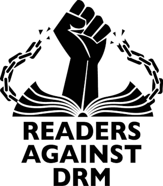
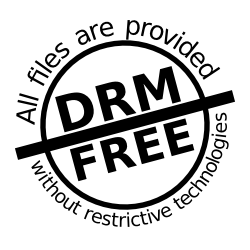

+++
title = "Do not Restrict Me! How copy protection (DRM) on e-books harms our freedom and what to do about it"
date = 2024-01-05T20:39:34+01:00
description = "In this post I argue against copy protection (DRM) on e-books (and in general) and how it harms interoperability, software freedom, fair use and consumer privacy. I also show that DRM can be broken because the technology is defective by design. I give some pointers for Linux users to allow them to read their own legally acquired e-books with any suitable free open source software."

[extra]
cover = "drm-reading.png"
+++

# Do not Restrict Me! How copy protection (DRM) on e-books harms our freedom and what to do about it

## Part I: DRM Hell

Like many people, I like reading books. My favourite genre is science fiction,
but I also like the occasional gay romance and I love to diversify by reading
books in different languages. My home isn't too spacious, and with two
completely filled-up bookcases there's little room left for more physical
books, so I've hopped on the e-book bandwagon over a decade ago, I generally
prefer things to be digital anyway. However, my love for all things digital
is significantly dampened by the nastiness that is DRM (Digital Rights
Management), the copy protection that encumbers the majority of e-books nowadays.

I've been using a Kobo Aura e-reader for a long time, Over the years, I have
bought my fair share of books. Getting them from the Kobo store or the
Dutch bol.com (which has some kind of partnership with Kobo) onto the reader
was a breeze. Most consumers would be happy with such an experience, but for me
there was always this nagging feeling that I was being locked into an ecosystem
and never really own the books I bought. 

What if my e-reader breaks? What if Kobo or Adobe goes bankrupt? Would I still have
access to all the books I bought? All my physical books will still be there
even in 50 years or so unless they befall to fire, burglary, rising sea levels,
or paper-devouring bookworms. With my normal digital data, I take
care to ensure similar longevity by making frequent backups and storing them in
simple interoperable formats that pass the test of time (like plain text, HTML,
etc). DRM encumbered data, however, is not normal digital data, it is encrypted
data. You can't read it without having the proper key. Now data encryption as
such is fine and something I'm a big proponent and heavy user of, but it stands
or falls on who has ownership of the key! Spoiler alert, with DRM it's not you!

When it comes to e-books with DRM, books are typically encrypted with a key
personalized for you, but *you don't own the personalized key to decrypt your
own books*. Worse, the whole technology relies on *obfuscation* of this
decryption key. The use of obfuscation in data security is flawed in principle,
there will always be clever people capable of breaking it (this is also the case for DRM).
DRM is a flawed technological solution for what is in fact a legal or socio-economic problem. 

The legal issue is that of copyright, the author or publisher of a book has the
exclusive right to sell copies of his/her own work, others are not permitted to
do so. This sounds fair enough to me. The creator who created the work should
be the one receiving the monetary gains from it, if he/she so desires. The
challenge is, whereas a physical book needs to be printed and shipped to the
customer, a digital resource copies effortlessly and can be sent all over the
world in no time. This means there is no longer any significant scarcity
involved in the distribution process from which value can be derived.

Those who enforce DRM upon us attempt to keep an old business model alive where
distribution was coupled to creation and tightly controlled, but this no longer
works. The *only* way to do so in a digital age is to place ever-further
restrictions on the user. When you watch a movie in a movie theatre, as opposed
to from your own home, you are in a fairly tightly controlled environment. You
play by the rules of the theatre and you pay essentially for a (single) viewing
experience. DRM software does something similar, it builds a tightly controlled
virtual theatre for you within the constraints of which you are allowed to do
your viewing. It never really works though, everything that you see on your
screen or hear from your speakers can in principle be copied. As cumbersome as
it might be, it's theoretically possible to make photographs of pages of your
DRM-protected book on your e-reader and then have the text extracted via OCR
(optical character recognition), or to record an audio/video stream with a
microphone and camera. In a real movie theatre there are rules against this:
you're under some form of surveillance, you'll probably be be kicked out if you
start recording the movie from your smartphone. In the software theatres that
DRM forces you into, you're under an ever-encroaching kind of surveillance too
and you are shipped a crippled product that is [defective by
design](https://www.defectivebydesign.org/). The core tenet is: the
user/consumer can not be trusted and the rights of the producer outweigh the
rights of the consumer.

The use of DRM means that only software that implements proprietary DRM
technology like Adobe DRM, can decrypt the book on your behalf and show it.
This is also how e-readers do it. Such software is, probably by contract with
the supplier of the DRM technology, bound to all kinds of restrictions designed
to *keep the actual data as far away from the user* as possible. Such software
is by definition fundamentally incompatible with the free and open source
software that I cherish and choose to use. DRM relies on obfuscation, openness
and freedom is its anti-thesis, DRM requires proprietary software libraries that usually
come with a licensing fee to be paid by whoever builds the viewer software to
the DRM technology supplier. DRM in itself is an industry, and whereas
supporting the authors that write the books I love is something I whole-
heartedly support, a major share of the profit ends up not with the author but
with publishers and platforms whose practises I do oppose.

More and more, our devices impact our privacy and monitor how we use them.
Knowing exactly what books we read (or what music we listen, videos we watch) is a
treasure trove for parties like Amazon, Google, Apple, Kobo, etc.. because it
allows them to 1) recommend and sell more similar books to us and 2) build up a
profile of our interests which has value (= can be sold) to anyone who wants to
target us with advertisements.

In democratic societies we tend to value freedom of opinion, without it our
democratic societies could not exist. The books we read, the information we
consume, are pivotal in a free society and says a lot about us. It may also
divulge a lot about us to potential adversaries (political or otherwise). It is
not a coincidence that dictatorships often start with book bannings and
burnings. I therefore think it is fundamentally important that information on
our reading habits and media consumption in general is not collected by any one
or few major players, be it companies or governments. The potential for abuse
is just too great.

Technologies like DRM, aside from being technically flawed in principle, also provide the
wrong incentives, they hinder interoperability and lead to the emergence of one
or a few centralised solutions. Those who control these solutions then sit on a
treasure trove of potential data that is just waiting to be exploited. They
also hinder any alternative legitimate use I might have on the books I buy, say
I want to do scientific research by doing some kind of statistical analysis on
the text, or some kind of annotation on the text. I am a research software
developer developing precisely such (open) software. But all of this is not possible
on DRM encumbered e-books as the actual text is being deliberately kept as far away
from me as possible!

Likewise, I can't just build an open e-reader software myself, say based on
[postmarketOS](https://postmarketos.org) and [SXMO](https://sxmo.org), both of
which have been [successfully tried on a Kobo Clara
HD](https://www.youtube.com/watch?v=ByvmEqJvZBU), because it would not be able
to open anything touched by DRM, making it pretty useless for the average
consumer. I'd be very interested in trying if I can get something like this
working on my Kobo Aura and read my books using our own Sxmo system! Or what if
I wanted to build a search index to search in the text of all the books I own?
If it were not for DRM, I could easily build this, but DRM makes would make me
reliant on third-party proprietary software. Normal competition is stifled as
the DRM provider act as a gatekeeper that demands the user can only access a
crippled defective version of the actual product.

## Part II: Do not Restrict me!

I'm writing all of this because my Kobo reader has been having some
difficulties lately so I decided to look for a replacement. 
This opened the gates to the DRM hell I depicted above. 

Being aware of the ecosystem I was being locked into, I decided this was a good
moment to break with it and opt for more freedom and sustainability. I chose a
Pocketbook e-reader (the PocketBook Inkpad Color 3 to be precise) as this brand
seems to be one of the few e-readers that isn't as tied to a store as for
example Amazon Kindles (they are the worst) or, to lesser extend, Kobo devices are. It's a device
that can still be fully used without requiring you to log in with some kind of
cloud account. The exception being of course DRM, the device supports Adobe's
DRM technology and you need an Adobe ID if you want to be able to read books
tainted by it. I reluctantly registered such an account.

So how do I transfer the DRM books I have on my old Kobo to my new Pocketbook? I
can't grab the EPUB files from the Kobo because they'd be encrypted
specifically for that device using Kobo's own DRM scheme. Stores like Kobo and
bol.com have a download option. This suggests you can download the e-books but
in fact, in case of Adobe DRM encumbered e-books you don't even get the
encrypted EPUB files, but you get so-called ACSM files (Adobe Content Server
Message) instead. These are *not* the actual book but is merely a receipt that
a client can in turn send to Adobe's server to obtain the (encrypted) book. The
message contains information such as your personal UUID and Adobe account details.

My PocketBook e-reader is supposed to support these ACSM files and obtain the
encrypted DRM-encumbered books for me. This would be the obvious route for the
normal user. However, it didn't work for some unknown reason: I got a cryptic
`E_ADEPT_NO_FULFILLMENT_RESULT` error when trying to open the ACSM files
directly on my new reader. This shows that the technology is fragile and that
if things break, there's not much you can do. For any normal non-technical user
things would have already gotten too difficult by now.

Fortunately I'm not a non-technical user and I don't give up easily, my next
try was to go via a program called "Adobe Digital Editions", this is
proprietary software that can read these ACSM files and obtains the encrypted
EPUB file for you. Both in this program as well as on the device, I register
the same Adobe ID, and then the encrypted EPUB files this program downlods can
be transferred and decrypted/displayed by the e-reader.

A major caveat is that Adobe Digital Editions is proprietary software that is
available (free of charge), but only for Windows or macOS, or for Android or
iOS nowadays as well. But I have none of those systems nor intend to buy any of
them just so I can access my books! As a FOSS enthusiast I run on Linux systems
exclusively.

There's a solution though, I (again, reluctantly) installed [Adobe Digital
Editions
4.5](https://appdb.winehq.org/objectManager.php?sClass=version&iId=33276) via
[Wine](https://winehq.org) on my Arch Linux system. I'll guide you to the steps in case
anybody finds themselves in a similar conundrum:

1. On Arch Linux, first [enable multilib](https://wiki.archlinux.org/title/Official_repositories#Enabling_multilib) so you can install 32-bit software like Wine on a 64-bit system.
2. Then install wine and various dependencies you might need: `pacman -Syu wine winetricks wine-mono lib32-gnutls samba`
3. Set a new `WINEPREFIX` and `WINEARCH`: `export WINEPREFIX=~/.adewine/ WINEARCH=win32`
4. Create the `WINEPREFIX`: `winecfg` 
5. Install Adobe Digital Editions 4.5 via winetricks: `winetricks -q adobe_dige4` 
6. Start Adobe Digital Editions:
`WINEPREFIX=~/.adewine WINEARCH=win32 wine $WINEPREFIX/drive_c/Program\ Files/Adobe/Adobe\ Digital\ Editions\ 4.5/DigitalEditions.exe`
7. Register your Adobe ID in the program.

If that is all done, you can now import ACSM files in Adobe Digital Editions.
It will use the query the Adobe server to obtain the actual encrypted book and
puts encrypted EPUB or PDF files in a directory `My Digital Editions` in
`C:\users\$USERNAME\Documents\`. If you are lucky this is already mapped to
your `~/Documents`. These you can transfer to your e-reader. You can also let
Adobe Digital Editions transfer things to your e-reader but I didn't try that
as I prefer to let it do as little as possible and didn't want to go into the
hassle of getting a USB device accessible via wine.

At this point I finally managed to get my encrypted books onto the e-reader and
the e-reader actually manages to open them. But... the books are still tainted
by DRM which is not what I want.

As DRM is a flawed technology to begin with, it should not be surprising that
it has been reverse engineered and broken. For Adobe ADEPT DRM this was
initially [published back in 2009 by a user under the pseudonym
i♥cabbages](http://i-u2665-cabbages.blogspot.com/2009/02/circumventing-adobe-adept-drm-for-epub.html).
This software has been integrated into
[DeDRM-tools](https://github.com/nodrm/DeDRM_tools), which is a plugin for the
open source e-book management software [Calibre](https://calibre-ebook.com/). On Arch Linux,
install calibre with `pacman -Syu calibre` and install the plugin from the Arch
User Repository with `yay -S calibre-plugin-dedrm` (or whatever other AUR
helper you use).

I recommend you launch `calibre` from a terminal so you can see its standard error output.

If Adobe Digital Editions is installed and you now import a DRM-protected EPUB,
i.e. the ones you got from Adobe Digital Editions, the DeDRM plugin will
automatically extract the encryption key from the Adobe Digital Editions
installation and subsequently decrypt the book. The resulting EPUB will finally
be a normal one which you can read *anywhere*. 

The caveat again is that this a bit tricky to get working since we run Adobe
Digital Editions in Wine. In the Calibre plugin settings for DeDRM tools, you need to explicitly set
the wine prefix to `~/.adewine`. Moreover, the DeDRM scripts are written in Python and some of them will
have to run *inside* Wine, so we need a Python installation in our WINEPREFIX, I
installed one as follows:

1. Grab a 32-bit Windows installer version of Python 3: `wget https://www.python.org/ftp/python/3.7.8/python-3.7.8.exe`
2. Run the installer `WINEPREFIX=~/.adewine WINEARCH=win32 wine python-3.7.8.exe`.
3. Install the required cryptography module for Python: `WINEPREFIX=~/.adewine WINEARCH=win32 wine ~/.adewine/drive_c/users/$USER/AppData/Local/Programs/Python/Python37-32/python.exe -m pip install pycryptodome`
4. Launch `calibre`, (make sure to set the wine prefix in the plugin configuration screen for DeDRM-tools), then import your DRM EPUBs.
5. The resulting EPUBs in your Calibre Library directory will now be fully decrypted, i.e.
   not tainted by DRM. You can transfer them to your e-reader *or open them
   with any normal EPUB viewer anywhere*!
6. Make sure to export your extracted key from Calibre's plugin configuration screen for DeDRM-tools. This will be produce a `der` file. It ensures that even if Adobe at some point changes their obfuscation algorithm so key extraction no longer works, you still have the decrypted key and can import it back.

When removing DRM you must of course take care not to redistribute/share the
resulting files, that would be a clear violation of copyright law anywhere. I explicitly
*do NOT advocate for NOR encourage you to violate such laws*, I merely advocate
for software freedom, proper interoperability, long term sustainability,
consumer privacy and freedom from surveillance. I argue against DRM
technology because it is is detrimental to all those things and technologically
faulty by design because it relies on obfuscation.

As to the legality of removing DRM *from your own e-books without
redistributing them*, I am by no means a lawyer, but you can read this article
that provides a fairly thorough perspective: [Is removing DRM illegal?
Demystifying the Legality of Removing Digital Rights
Management](https://techyoulike.com/is-removing-drm-illegal/).

Last, but not least, I would like to urge the reader to seek out those
publishers and authors that sell DRM-free books and buy books from them
whenever possible. A notably one in the Science Fiction genre is [Tor
Books](https://www.tor.com/) (not to be confused with the Tor Network which is
completely unrelated). Notable DRM-free stores are
[Smashwords](https://smashwords.com) and [Lulu](https://www.lulu.com/shop), see
[Guide to DRM-Free Living:
Literature](https://www.defectivebydesign.org/guide/ebooks) for more.

## Credits and references

* [Free Software Foundation](https://fsf.org) for their [Defective by Design](https://www.defectivebydesign.org) campaign and the DRM-free imagery.
  * [Guide to DRM-Free Living: Literature](https://www.defectivebydesign.org/guide/ebooks)
* [DeDRM-tools](https://github.com/nodrm/DeDRM_tools) by Apprentice Harper, Apprentice Alf, NoDRM, i♥cabbages and many others.
* Book burning comic by Bill Bramhall, Bramhall's World as published in the New York Daily News (2018): <https://www.nydailynews.com/2018/02/01/bramhall-cartoons-for-january-2018/>
* [Martijn Braam](https://blog.brixit.nl/) for his work on showing [postmarketOS](https://postmarketos.org) and [sxmo](https://sxmo.org) on the Kobo Clara HD: [video](https://www.youtube.com/watch?v=ByvmEqJvZBU)
* Willie Howard. TechYouLike. [Is removing DRM illegal? Demystifying the Legality of Removing Digital Rights
Management](https://techyoulike.com/is-removing-drm-illegal/)
* [Calibre](https//calibre-ebook.com) - e-book management software
* [Tor Books](https://www.tor.com/) - DRM-free publisher
* [Smashwords](https://smashwords.com) - DRM-free store
* [Openclipart.org](https://openclipart.org):
  * <https://openclipart.org/detail/320872/woman-reading-in-sunset> from <https://www.publicdomainpictures.net/en/view-image.php?image=264941&picture=reading-read-peacefulwoman-dusk>
  * <https://openclipart.org/detail/38869/stack-of-paperbacks>
  * <https://openclipart.org/detail/170514/keys>
  * <https://openclipart.org/detail/68545/padlock-icon-rounded>
  * <https://openclipart.org/detail/323509/security-camera>

## Discredits

Adobe, Amazon, Google and all those many others enforcing DRM technology on end-users.

## Comments

You can comment on this post [on the fediverse/mastodon](https://social.anaproy.nl/@proycon/111705057662051402).

