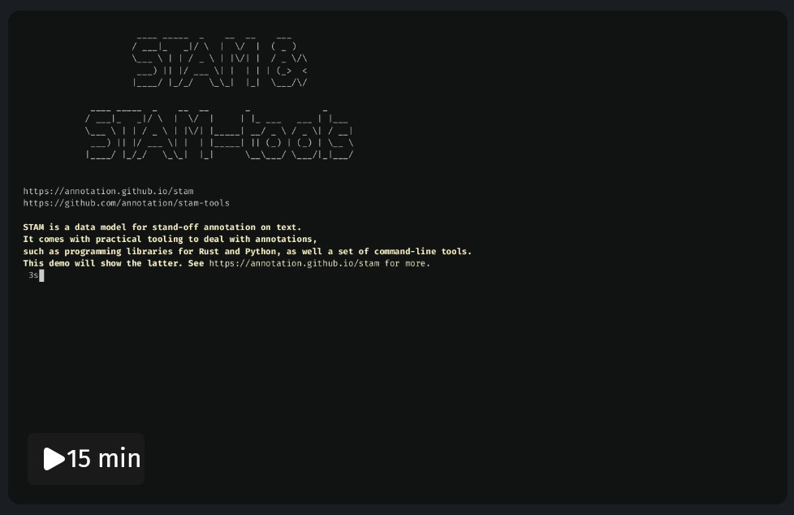
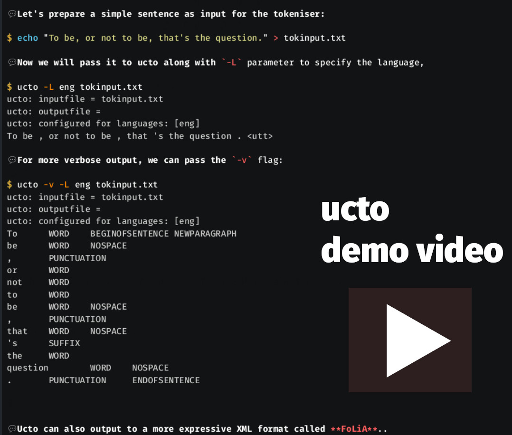
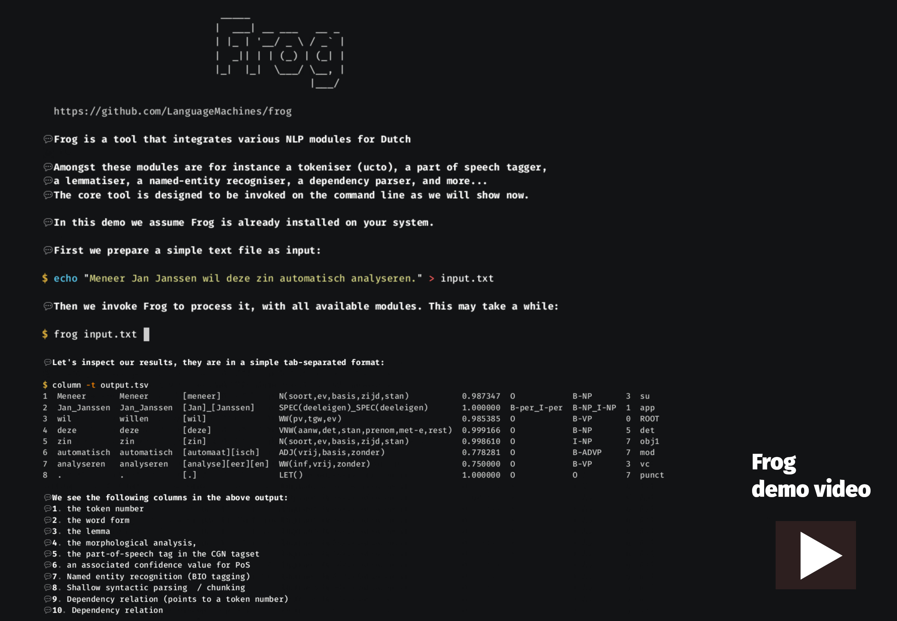
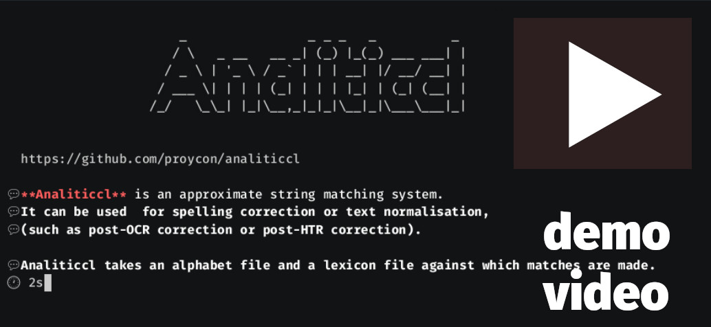
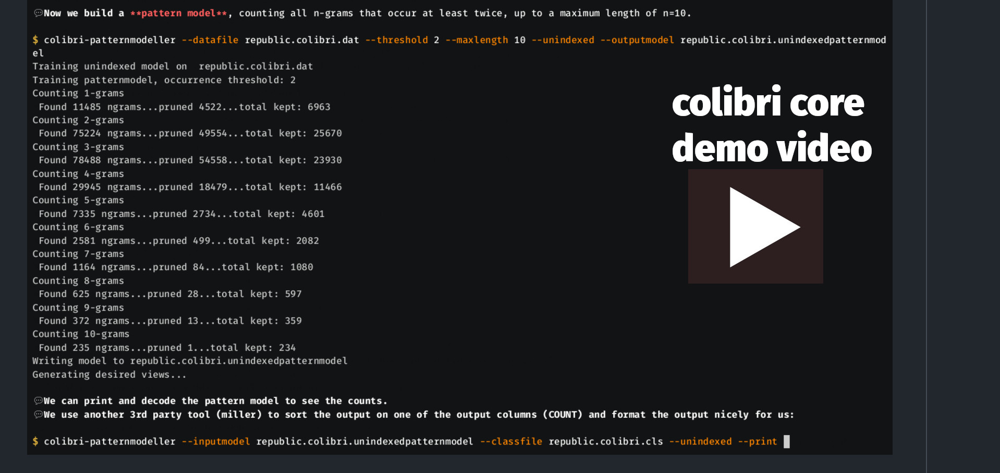
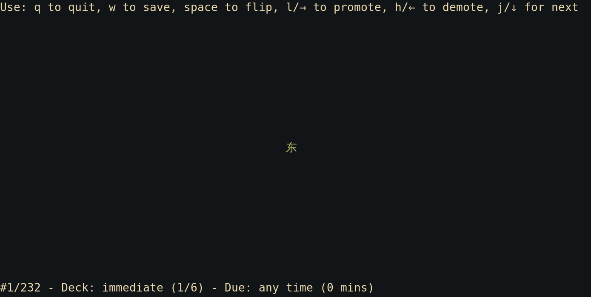

+++
title = "Text processing on the Command Line - sharing my tools"
date = 2024-07-07T13:48:28+02:00
description = "In this article I share my enthusiasm for text processing on the unix command line. First I just list some of the underlying principles and common tools; then I share the various text processing tools I myself have written over the years. Some of the larger tools are accompanied by screencast videos to quickly give you an impression of what they can do."

# Tags and categories
# For example, use `tags = []` for no tags, or the form `tags = ["A Tag", "Another Tag"]` for one or more tags.
tags = ["cli","nlp","text processing on the command line","terminal","unix philosophy","linux","console"]
categories = []

[extra]
cover = "myclicover.jpg"
+++

# Text processing on the command line - sharing my tools

## Introduction

I'm quite fond of the command-line and spend a larger chunk of my life in a
terminal emulator than I dare admit. I try to embrace the unix philosophy of
using tools that *"do one thing only, and do it well"* and *"interconnect
largely via plain text formats"*. Following this philosophy, the output of one
program can typically be the input to the next, for instance through the pipe
operator (`|`) in a command-line shell.

Chaining multiple heterogeneous tools in this way gives a great amount of power
and flexibility, something that's much harder to achieve through complex
monolithic GUIs. It allows to quickly automate things in shell scripts and do
batch processing, even if the underlying tools are written in different
languages.

For text processing and data science, the *unix shell and environment* kind of
form the *lingua franca of data science*; a common foundation upon which we can
build our data processing pipelines. This environment is usually a unix-like
system such as Linux or macOS that offers a (POSIX-compliant) shell like bash
and a set of core utilities such as provided by [GNU
coreutils](https://www.gnu.org/software/coreutils/coreutils.html) and friends,
by FreeBSD/OpenBSD/NetBSD/macOS itself or by
[busybox](https://www.busybox.net). All of these are different implementations
of the same core utilities, but following some standard specification ([POSIX](https://en.wikipedia.org/wiki/POSIX)).
Even Windows users have access to such a command-line environment via the
[WSL](https://learn.microsoft.com/en-us/windows/wsl/), or alternatively via
[Cygwin](https://cygwin.com/). 

I'll first mention some of these standard unix tools, then some additional tools, and
finally I'll move on to what is the main subject of this writing: [my tools](#my-tools); the text
processing tools for the command-line which I myself developed (or co-developed) and want to share with you.

## Basic standard tools

Out of the box, a unix environment usually gives you text processing tools like:

* `awk` - pattern scanning and processing language 
* `cat` - print or concatenate text (or `tac` to do it in reverse)
* `cut` -  extract/remove columns from lines
* `column` - format input into multiple columns
* `colrm` - remove columns from a file 
* `comm` - compare two sorted files line by line
* `dos2unix` - convert DOS/Windows line endings to UNIX (`\r\n` -> `\n`)
* `diff` - compare files line by line and show where they *diff*er
* `echo`/`printf` - print text
* `expand` - convert tabs to spaces
* `fold` - wrap each input line to fit in a specified width
* `head`/`tail` - extract the first/last lines of a text
* `grep` - print lines that match patterns (regular expressions)
* `nl` - assign numbers to lines in a file
* `paste` - merge lines from multiple files into one
* `rev` - *rev*erse lines character-wise
* `tr` - *tr*anslate or delete characters (here translation  is just a mapping between character, not between natural languages)
* `sed` - *s*tream *ed*itor for filtering and transforming text
* `shuf` - shuffle lines in a random order
* `split` - split a file into several equally-sized pieces
* `sort` - sort lines
* `uniq` - remove duplicate lines
* `wc` - word count, line count, byte count

They shine when used together. Take the example of having a plain text file,
and wanting to extract a top 1000 frequency list of the words in it, all
lower-cased. All this can be captured in the following one-liner:

```
$ sed -E 's/\W+/\n/g' text.txt | tr '[:upper:]' '[:lower:]' | tr -s '\n' | sort | uniq -c | sort -rn | head -n 1000
```

An analysis of the many possibilities of these common unix tools for text
processing and data analysis is well out of scope for this writing. I do not
intend to write a tutorial here. If you are interested in such a thing, I can warmly
recommend the O'Reilly book [Data Science at the Command
Line](https://jeroenjanssens.com/dsatcl/) by Jeroen Janssens, freely accessible
on-line. It also covers some of the tools I mention in the next section, and more.

## Common additional tools

In addition to these standard unix tools that are often part of the core system,
there are more specialised tools I can recommend for text & data processing. The following few work with
structured data like JSON, CSV or XML and overlap partially in functionality:

* [`jq`](https://jqlang.github.io/jq/) - like `sed` but specifically for extracting and manipulating JSON data, written in C.
* [Miller](https://github.com/johnkerl/miller) - `mlr` - like awk, sed, cut, join, and sort for name-indexed data such as CSV and tabular JSON. Written in Go.
* [xsv](https://github.com/BurntSushi/xsv) - CSV command line toolkit, written in Rust.
* [`dasel`](https://github.com/TomWright/dasel)  - to query and modify JSON/CSV/YAML/XML , written in Go.
* [csvkit](https://github.com/wireservice/csvkit) - suite of utilities for working with CSV (`csvlook`, `csvcut`, `csvgrep`,`csvjson`, `csvsql`, `csvstat`), written in Python.
* `xmllint` in [libxml2](https://gitlab.gnome.org/GNOME/libxml2)  - to validate and query XML files (xpath), written in C.

For visualisation purposes, I first have to give an honourable mention to
`less` and `more`, both of which do more or less the same (pun intended). They
serve as the so-called *pager*. For a richer experience, I can recommend the following:

* [`bat`](https://github.com/sharkdp/bat) - a `cat` clone and/or `less` alternative with fancy features like syntax highlighting; great for viewer all kinds of files, written in Rust.
* [`glow`](https://github.com/charmbracelet/glow) - a Markdown viewer, written in Go.
* `csvlook` from [csvkit](https://github.com/wireservice/csvkit) - viewer for CSV files, written in Python.

When it comes to conversion of texts, I recommend the following:

* [`pandoc`](https://pandoc.org/) - A universal document converter. Converts between many document formats such as LaTeX/Markdown/ReStructuredText/plain text/Asciidoc/Word/Epub/Roff/etc... Written in Haskell.
* `iconv` - convert plain text from one character encoding to another. Written in C.
* `uconv` from [icu](https://icu.unicode.org/) - convert plain text from one character encoding to another. Written in C.

To combine these and all kinds of other data processing tools into larger
automated pipelines, the most basic solution is to write a shell script.
Alternatively, you can write a `Makefile` that builds targets using
[`make`](https://www.gnu.org/software/make/). The latter also offers a certain
degree of parallelisation using the `-j` parameter. Another useful tool to
consider for parallelisation is
[`parallel`](https://www.gnu.org/software/parallel/) and/or `xargs` with the
`-P` parameter. The latter, `xargs`, is also a basic standard tool useful when
building sequential pipelines.

Remembering how to invoke all these command line tools may be rather daunting,
and nobody expects you to remember everything anyway. Of course, a manual page
should be available by simply running `man` followed by the command you need
help on. You should also be able to get usage information from the tool itself
by passing `-h` and/or `--help`. If you're lazy like me and prefer to quickly
get some very short concise usage examples for a number of common use cases for
a tool, then I can recommend
[`tldr`](https://github.com/tldr-pages/tldr) (internet slang for *"too
long; didn't read"*).

## Intermezzo: What about Python/Julia/R etc...?

Bear with me before I finally get to show you my own tools. At this point some
readers may wonder: All this command-line stuff is fine, but why not just use
Python, or R, or Julia or whatever other open-source language implementation
you prefer? (this excludes proprietary ecosystems like Matlab and Wolfram which
I explicitly condemn). Languages like Python/Julia/R come with a solid standard
library and on top of that a wide range of third party libraries to accommodate
all kinds of text processing needs or whatever else a data scientist might
desire. Furthermore, they too come with an interactive shell or can be used in
the web-browser in the form of Notebooks
([Jupyter](https://jupyter.org/)/[Pluto](https://plutojl.org/)/[RStudio](https://rmarkdown.rstudio.com/lesson-10.html)),
Some may find the latter more appealing than a terminal, especially for data
stories and teaching.

Indeed, I say in response, these are all perfectly fine solutions and great
projects. Such language ecosystems tend to give you tighter coupling between
components and cleaner abstraction than the unix shell can. The shell often has
more archaic syntax and interoperability is not always optimal because each
tool can be very different. The shell, however, does provide a kind of
lowest-common denominator that no other can. It offers a great deal of
flexibility with regards to the tools you use. It's been around for decades and
likely will last a while longer. Whether your command-line interface is written
in C, C++, Rust, Go, Zig, Hare, R, Python, Perl, Haskell, Lisp, Scheme, or God
forbid, even Java, it can all be readily mixed. Just by virtue of having a
command line interface and reading either from file or standard input, and
outputting to file or standard output. Committing yourself to a higher-level
language, on the other hand, adds an extra layer, often in the form of a
high-level language interpreter which has its own overhead and limits certain
choices. This has both benefits and drawbacks. The trade-off is often between
diversity and uniformity.

This is not a question of one method being inherently superior to the other, it
all depends on your use case, the complexity thereof, the technologies you and
those working with you are familiar and comfortable with, and your intended
audience; the users. You then choose the form of interface that fits these
conditions best; whether it is invoking tools via command-line interfaces,
calling functions in software libraries via an API, or WebAPI, or even clicking
buttons in GUIs.

## My tools

In this writing, I would like to introduce some of the tools I wrote over the
years for text processing, often in line of my work. As mentioned in the
introduction, these tools are largely specialised in doing one thing, and doing
it well, as per the unix philosophy. As the years go by, I'm more and more
drawn to *simpler* solutions, where *simple* entails:

* keeping the scope of a tool limited, constraining the amount of features
* keeping a codebase maintainable by not letting it grow too large
* limiting the number of dependencies (and in doing so limiting security vulnerabilities as well)
* getting the job done with optimal performance, reducing the amount of unnecessary overhead.

[Rust](https://www.rust-lang.org/) is my language of choice nowadays, as it
compiles to highly performant native code on a variety of platforms and
processor architectures. It offers important safety guarantees that prevents a
whole range of common memory bugs that are prevalent in other system's
programming languages as C and C++. You will therefore find a lot of my tools
are written in Rust, often with a Python binding on top for accessibility for
researchers and developers from Python. All software I write is free open
source software available, almost always under the GNU General Public License
v3.

I will be listing the tools in approximate order from simpler to more complex tools:

* [`charfreq`](#charfreq) - Tiny tool that just counts unicode character frequencies from text it receives on standard input.
* [`hyphertool`](#hyphertool) - Hyphenation  tool, performs wordwrap at morphologically sensible places for a number of languages.
* [`ssam`](#ssam) - *Split sampler* to draw train/development/test samples from plain text data using random sampling.
* [`lingua-cli`](#lingua-cli) - Language Detection 
* [`sesdiff`](#sesdiff) -  Computes a Shortest Edit Script that shows the difference between two strings on a character-level
* [`lexmatch`](#lexmatch) - Matching texts against one or more lexicons

The above tools were all fairly small, now we're moving on to bigger software
projects, mostly developed in the scope of my work at the KNAW Humanities
Cluster and Radboud University Nijmegen, often under the umbrella of the
CLARIN-NL and CLARIAH projects.

* [`stam`](#stam) - Toolkit for stand-off annotation on text
* [`ucto`](#ucto) - Unicode tokeniser
* [`frog`](#frog) - NLP suite for Dutch
* [`analiticcl`](#analiticcl) - Fuzzy string-matching system used e.g. for spelling correction, text normalisation
or post-OCR correction. 
* [`colibri-core`](#colibri-core) - Efficient pattern extraction (n-grams/skipgrams/flexgrams) and modelling from text.
* [`folia-tools`](#folia-tools) - Toolkit for working with the [FoLiA XML format](https://proycon.github.io/folia).

Last, a small tool that is a bit of an odd-one-out in this list, but which I wanted to include anyway:

* [`vocage`](#vocage) - Vocabulary training with flashcards (spaced-repetition system aka Leitner)

I'll briefly discuss each of the mentioned programs. Click the above links to quickly jump to the relevant section.

### charfreq

`charfreq` is a very simple tiny CLI tool that just computes (unicode) character frequencies from text received via standard input. Written in Rust.

You can find `charfreq` on [Sourcehut](https://git.sr.ht/~proycon/charfreq) or [Github](https://github.com/proycon/charfreq/).

### hyphertool

`hyphertool` does hyphenation and builds upon the third party
[hypher](https://github.com/typst/hypher) library, which in turn uses rules from
the TeX hyphenation library. It is written in Rust.

```
$ hyphertool --language nl --width 15 test.txt
Dit is een test-
bestand. Kan je
dit bestand mooi
voor mij verwer-
ken?
Ik hoop op
een positief re-
sultaat.
```

It can also also output all syllables using hyphenation rules:

```
$ hyphertool --language nl test.txt
Dit is een test-be-stand. Kan je dit be-stand mooi voor mij ver-wer-ken?
Ik hoop op een po-si-tief re-sul-taat.
```

Or with character offsets:

```
$ hyphertool --language nl --standoff test.txt
Text	BeginOffset	EndOffset
...
Ik	68	70
hoop	71	75
op	76	78
een	79	82
po	83	85
si	85	87
tief	87	91
re	92	94
sul	94	97
taat	97	101
```

For more information, see `hyphertool` on
[Sourcehut](https://git.sr.ht/~proycon/hyphertool),
[Github](https://github.com/proycon/hyphertool/) or
[Crates.io](https://crates.io/crates/hyphertool).

### ssam

I wrote [ssam](https://github.com/proycon/ssam), short for Split sampler, as a
simple program that splits one or more text-based input files into multiple sets using
random sampling. This is useful for splitting data into a training, test and
development sets, or whatever sets you desire. This software was written in Rust.

It works nicely with multiple files when entries one the same lines correspond
(such as sentence-aligned parallel corpora). Suppose you a `sentences.txt` and a `sätze.txt` with the same
sentences in German (i.e. the same line numbers correspond
and contain translations). You can then make a dependent split as follows:
```
$ ssam --shuffle --sizes "0.1,0.1,*" --names "test,dev,train" sentences.txt sätze.txt
```

For more information, see `ssam` on
[Sourcehut](https://git.sr.ht/~proycon/ssam),
[Github](https://github.com/proycon/ssam/) or
[Crates.io](https://crates.io/crates/ssam).


### sesdiff

`sesdiff` is a small and fast command-line tool and Rust library that reads a
two-column tab separated input from standard input and computes the shortest
edit script (Myers' diff algorithm) to go from the string in column A to the
string in column B. In other words, it computes *how strings difer*. It also
computes the edit distance (aka levenshtein distance). It builds upon the
[dissimilar](https://crates.io/crates/dissimilar) library by David Tolnay for
the bulk of the computations.

```
$ sesdiff < input.tsv
hablaron        hablar     =[hablar]-[on]                  2
contaron        contar     =[contar]-[on]                  2
pidieron        pedir      =[p]-[i]+[e]=[di]-[eron]+[r]    6
говорим         говорить   =[говори]-[м]+[ть]              3
```
 
The output is in a four-column tab separated format (reformatted for legibility
here, the first two columns correspond to the input).

It can also do the reverse, given a word and a edit recipe, compute the other string.

It was initially designed to compute training data for a lemmatiser.

For more information, see `sesdiff` on
[Sourcehut](https://git.sr.ht/~proycon/sesdiff),
[Github](https://github.com/proycon/sesdiff/) or
[Crates.io](https://crates.io/crates/sesdiff).

### lingua-cli

`lingua-cli` is a command-line tool for **language detection**. Given a text,
it will predict what language a text is in. It supports many languages. It can
also predict per line of the input, as the underlying algorithm is particularly
suited to deal with shorter text, or it can actively search the text for
languages and return offsets. This program is a mostly a wrapper around the
[lingua-rs](https://github.com/pemistahl/lingua-rs) library by Peter M. Stahl. It is written in Rust. The
3rd party library is also available for
[python](https://github.com/pemistahl/lingua-py),
[go](https://github.com/pemistahl/lingua-go), and [Javascript via
WASM](https://github.com/pemistahl/lingua-js).

```
$ echo -e "bonjour à tous\nhola a todos\nhallo allemaal" | lingua-cli --per-line --languages "fr,de,es,nl,en"
fr      0.9069164472389637      bonjour à tous
es      0.918273871035807       hola a todos
nl      0.988293648761749       hallo allemaal
```

Output is TSV and consists of an iso-639-1 language code, confidence score, and in line-by-line mode, a copy of the line.
In `--multi` mode, it will detect languages in running text and return UTF-8 byte offsets:

```
$ lingua-cli --multi --languages fr,de,en < /tmp/test.txt
0       23      fr      Parlez-vous français? 
23      73      de      Ich spreche ein bisschen spreche Französisch ja. 
73      110     en      A little bit is better than nothing.
```

For more information, see `lingua-cli` on
[Sourcehut](https://git.sr.ht/~proycon/lingua-cli),
[Github](https://github.com/proycon/lingua-cli/) or
[Crates.io](https://crates.io/crates/lingua-cli).

### lexmatch

`lexmatch` is a simple lexicon matching tool that, given a lexicon of words or
phrases, identifies all matches in a given target text, returning their exact
positions. It can be used compute a frequency list for a lexicon, on a target
corpus. The implementation uses either suffix arrays or hash tables. The
lexicon is in the form of one word or phrase per line. Multiple lexicons are supported. It is written in Rust.

```
$ lexmatch --lexicon lexicon.lst corpus.txt
```

Rather than take a lexicon, you can also directly supply lexical entries (words/phrases) on the command line using `--query`:

```
$ lexmatch --query good --query bad /nettmp/republic.short.txt 
Reading text from /tmp/republic.short.txt...
Building suffix array (this may take a while)...
Searching...
good    4       193     3307    3480    278
bad     3       201     3315    3488
```

By default, you get a TSV file with a column for the text, the occurrence
count, and one with the begin position (UTF-8 byte position) for each match
(dynamic columns). In `--verbose` both you get cleaner TSV with separate UTF-8
byte offsets for each match:

```
$ lexmatch --verbose --query good --query bad /nettmp/republic.short.txt
Text    BeginUtf8Offset EndUtf8Offset
Reading text from /tmp/republic.short.txt...
Building suffix array (this may take a while)...
Searching...
good    193     197
good    3307    3311
good    3480    3484
good    278     282
bad     201     204
bad     3315    3318
bad     3488    3491
```


For more information, see `lexmatch` on
[Sourcehut](https://git.sr.ht/~proycon/lexmatch),
[Github](https://github.com/proycon/lexmatch) or
[Crates.io](https://crates.io/crates/lexmatch).

### stam

[STAM Tools](https://github.com/annotation/stam-tools) is a collection of
command-line programs for working with stand-off annotations on plain text.
These all make use of the [STAM](https://annotation.github.io/stam) data model
and accompanying [library](https://github.com/annotation/stam-rust) for
representing annotations, which can also be exported as simple CSV or TSV. They
are written in Rust.

Each can be accessed through the executable `stam` and a subcommand. I mention just a few for brevity:

* ``stam align``     - Align two similar texts, mapping their coordinate spaces. This looks for similar strings in each text using the Needleman-Wunsch or Smith-Waterman algorithm.
* ``stam fromxml``   - Turn text and annotations from XML-based formats (like xHTML, TEI) into plain text with separate stand-off annotations following the STAM model. This effectively 'untangles' text and annotations.
* ``stam query`` or ``stam export``  -  Query an annotation store and export the output in tabular form to a simple TSV (Tab Separated Values) format. This is not lossless but provides a decent view on the data. It provides a lot of flexibility by allowing you to configure the output columns as you see fit.
* ``stam validate``  - Validate a STAM model, tests if all annotation offsets still point to the intended text selections.
* ``stam tag``       - Regular-expression based tagger on plain text, it also serves as a good tokeniser.
* ``stam transpose`` - Given an alignment between text (as computed by `stam align`), converts annotations in one coordinate space to another.
* ``stam view``      - View annotations as queried by outputting to HTML (or ANSI coloured text).

A demo video is available that demonstrates all these and more:

[](https://annotation.github.io/stam/assets/stam.webm)

See [STAM](https://annotation.github.io/stam) for more information about the
data model and the general project, and
[stam-tools](https://github.com/annotation/stam-tools) for information
specifically about these command-line tools. A [python
binding](https://github.com/annotation/stam-python) is also available (`pip install stam`).

### ucto

[Ucto](https://languagemachines.github.io/ucto/) is a regular-expression based
tokeniser. It comes with tokenisation rules for about a dozen languages. It is
written in C++, initially by me but then in much larger part by my colleague Ko
van der Sloot.

[](https://github.com/CLARIAH/wp3-demos/blob/master/ucto.gif)

See [the Ucto website](https://languagemachines.github.io/ucto/) for more information. A Python binding
is also available (`pip install ucto`).

### frog

[Frog](https://github.com/LanguageMachines/frog) is a tool that integrates
various NLP modules for Dutch. Such as a tokeniser (ucto), part of speech
tagger, lemmatiser, dependency parser, named-entity recogniser, dependency
parser and more. It is written in C++ by Ko van der Sloot as lead developer,
and by myself, Antal van den Bosch and in its initial stages Bertjan Busser. It
has a long history containing various components that are also made possible by
Walter Daelemans, Jakub Zavrel, Sabine Buchholz, Sander Canisius, Gert Durieux
and Peter Berck.

Though parts of the Frog have been superseded by more recent advancements in
NLP, it is still a useful tool in many use-cases:

[](https://github.com/CLARIAH/wp3-demos/blob/master/frog.gif)

I also wrote a [python binding](https://github.com/proycon/python-frog) so you
can use Frog directly from Python (`pip install frog`).

See [the Frog website](https://languagemachines.github.io/frog/) for more information.

### analiticcl

[Analiticcl](https://github.com/proycon/analiticcl) is an approximate string
matching system. It can be used for spelling correction or text normalisation
and post-OCR correction. It does comparisons against one or more lexicons. This
may sound similar to [lexmatch](https://github.com/proycon/lexmatch) which I
introduced earlier. However, analiticcl goes a lot further than lexmatch. It does
not require exact matches with the lexicon but is designed to detect spelling
variants, and to do so efficiently. It is written in Rust and builds upon
earlier research by Martin Reynaert.

```
$ analiticcl query --lexicon examples/eng.aspell.lexicon --alphabet examples/simple.alphabet.tsv --output-lexmatch
--json < input.tsv > output.json
```

```json
[
    { "input": "seperate", "variants": [
        { "text": "separate", "score": 0.734375, "dist_score": 0.734375, "freq_score": 1, "lexicons": [ "examples/eng.aspell.lexicon" ] },
        { "text": "desperate", "score": 0.6875, "dist_score": 0.6875, "freq_score": 1, "lexicons": [ "examples/eng.aspell.lexicon" ] },
        { "text": "operate", "score": 0.6875, "dist_score": 0.6875, "freq_score": 1, "lexicons": [ "examples/eng.aspell.lexicon" ] },
        { "text": "temperate", "score": 0.6875, "dist_score": 0.6875, "freq_score": 1, "lexicons": [ "examples/eng.aspell.lexicon" ] },
        { "text": "serrate", "score": 0.65625, "dist_score": 0.65625, "freq_score": 1, "lexicons": [ "examples/eng.aspell.lexicon" ] },
        { "text": "separated", "score": 0.609375, "dist_score": 0.609375, "freq_score": 1, "lexicons": [ "examples/eng.aspell.lexicon" ] },
        { "text": "separates", "score": 0.609375, "dist_score": 0.609375, "freq_score": 1, "lexicons": [ "examples/eng.aspell.lexicon" ] }
    ] }
]
```

[](https://github.com/CLARIAH/wp3-demos/blob/master/analiticcl.gif)

See [the analiticcl source repository](https://github.com/proycon/analiticcl) for more information. A python
binding is also available (`pip install analiticcl`).

### colibri-core

[Colibri Core](https://proycon.github.io/colibri-core/) is software to quickly
and efficiently count and extract patterns from large corpus data, to extract
various statistics on the extracted patterns, and to compute relations between
the extracted patterns. The employed notion of pattern or construction
encompasses ngrams, skipgrams and flexgrams (an abstract pattern with one or
more gaps of variable-size).

N-gram extraction may seem fairly trivial at first, with a few lines in your
favourite scripting language, you can move a simple sliding window of size n
over your corpus and store the results in some kind of hashmap. This trivial
approach however makes an unnecessarily high demand on memory resources, this
often becomes prohibitive if unleashed on large corpora. Colibri Core tries to
minimise these space requirements.

Colibri Core is written in C++, a python binding is also available.

A demo video is available:

[](https://github.com/CLARIAH/wp3-demos/blob/master/colibri-core.gif)

See the [Colibri Core website](https://proycon.github.io/colibri-core/) for
more information. A journal article "[Efficient n-gram, Skipgram and Flexgram
modelling with
colibri-core](https://openresearchsoftware.metajnl.com/articles/10.5334/jors.105)"
was published in the Journal of Open Research Software (2016), and was also
included in my PhD dissertation.

### folia-tools

[FoLiA tools](https://github.com/proycon/foliatools) is a set of numerous
command-line tools I wrote for working with the FoLiA format.
[FoLiA](https://proycon.github.io) is an XML-based Format for Linguistic
Annotation. It is written in Python (`pip install folia-tools`). My colleague
Ko van der Sloot wrote complementary C++ tooling to work with the same format,
these are called [foliautils](https://github.com/LanguageMachines/foliautils).

Both contain a wide variety of programs such as validators, converters from and to
other document and annotation formats (TEI, PageXML, Abby, plain text,
ReStructuredText, CONLL, STAM) etc.

### vocage

[Vocage](https://git.sr.ht/~proycon/vocage) may be a bit of an odd-one out in
this list as it is not really a text processing tool as-such, but rather a TUI
(Terminal User Interface) for studying language vocabulary (which still counts
as text so is excuse enough for inclusion here). I wrote it in Rust.

Vocage works by presenting flashcards using a spaced-repetition algorithm,
which means it shows cards (e.g. words) you know well less frequently than cards you do not know yet.



The difference with more common software like [Anki](https://apps.ankiweb.net/)
is that vocage is fully terminal-based, has vim keybindings, and it stores its
data in a simple TSV format (both the wordlists as well as the learning
progress go in the same TSV file).

It was featured in a [video by Brodie Robertson](https://www.youtube.com/watch?v=NoilS3nbxs4&pp=ygUGdm9jYWdl) in 2021.

For more information, see `vocage` on
[Sourcehut](https://git.sr.ht/~proycon/vocage),
[Github](https://github.com/proycon/vocage) or
[Crates.io](https://crates.io/crates/vocage).

### Conclusion

I hope I have been able to convey some of my enthusiasm for the unix
command-line for text processing and natural language processing. Moreover, I
hope you find some of my software useful for some of your own projects.

You can publicly comment on this post [on the fediverse](https://social.anaproy.nl/@proycon/112745066604887083) (e.g. using mastodon).
